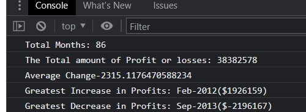

# Console-Finances

## Overview

Created code for analyzing the financial records of a company with  a financial dataset.

## User interface

The task is completed if 

 The total number of months included in the dataset.

* The net total amount of Profit/Losses over the entire period.

* The average of the **changes** in Profit/Losses over the entire period.
 * You will need to track what the total change in profits are from month to month and then find the average.
* The greatest increase in profits (date and amount) over the entire period.
* The greatest decrease in losses (date and amount) over the entire period.

## Output
This is the landing page.

## How to get Output

Open the console in the browser.
Right click on the page and click inspect and then click console.(Alternatively press Cmd + Option + J (on a Mac) or Cmd +Shift +J (on Windows).
Output can be seen here.

## URL

Website URL: https://lalyf.github.io/Console-Finances/

github URL: https://github.com/LalyF/Console-Finances.git

